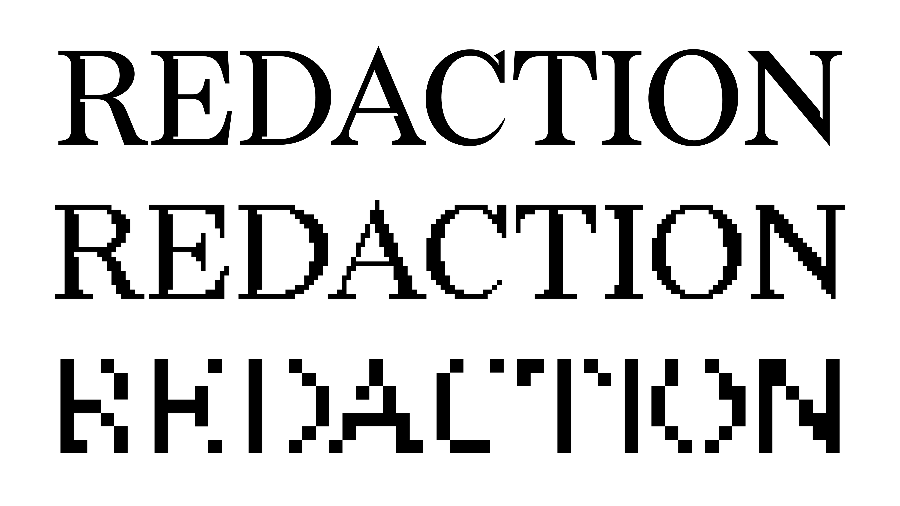
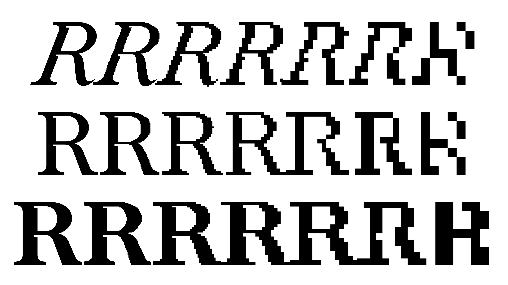

# Redaction



Redaction is a serif typeface designed by Jeremy Mickel (MCKL) with creative
direction by Forest Young. It was commissioned for *The Redaction*, the 2019
collaboration between artist Titus Kaphar and poet and lawyer Reginald Dwayne
Betts at MoMA PS1, which drew on lawsuits filed by the Civil Rights Corps on
behalf of people jailed because they could not pay bail, fines and fees.

The design is rooted in Times New Roman and Century Schoolbook, the de facto
typefaces of American legal documents, but the familiar forms are heightened:
soft round terminals meet razor-sharp thin strokes, a nod to the eagle of the
presidential seal holding both the olive branch and the arrows.


## Families

Redaction is published as seven related families. The base family is the clean
drawing; the numbered families are optical sizes rendered through
progressively degraded, bitmap-derived forms, referencing the photocopied and
degraded documents that move through the legal system. The numbered optical
sizes are not interpolation-compatible with one another, so the project is
released as static fonts rather than a variable font.



| Family        | Styles                  |
| ------------- | ----------------------- |
| Redaction     | Regular, Bold, Italic   |
| Redaction 10  | Regular, Bold, Italic   |
| Redaction 20  | Regular, Bold, Italic   |
| Redaction 35  | Regular, Bold, Italic   |
| Redaction 50  | Regular, Bold, Italic   |
| Redaction 70  | Regular, Bold, Italic   |
| Redaction 100 | Regular, Bold, Italic   |

Each font covers the Google Fonts Latin Core character set, with `locl`
support for Turkish, Azeri, Crimean Tatar and Romanian, plus fractions and
superior figures.

## Building

The fonts are built with [gftools-builder](https://github.com/googlefonts/gftools)
from the UFO sources in `sources/`:

```
pip install -r requirements.txt
make build
```

`make build` runs `gftools builder sources/config.yaml` and writes TTF, OTF and
WOFF2 files to `fonts/`. `make test` runs the
[Fontspector](https://fonttools.github.io/fontspector/) Google Fonts profile,
and `make proof` generates HTML proofs. GitHub Actions runs the same steps on
every push.

## Changelog

**25 September 2026. Version 1.004**

- PATCH: name table updated for open-source distribution (OFL copyright and
  license strings, designer and vendor fields); USE_TYPO_METRICS enabled and
  win metrics set family-wide (1000/300); STAT tables added to the statics.
- PATCH: OpenType features (locl, frac, sups) and BASE table now compiled into
  every style, not just Redaction Regular and Italic.
- PATCH: source cleanup -- comma-accent glyphs encoded in every optical size,
  Private Use Area codepoints removed, spacing accents no longer classed as
  marks, en/em spaces emptied in the Italics.
- Repository restructured to the Google Fonts upstream layout; the six bitmap
  optical sizes are built unhinted.
- MINOR: accents rebuilt around combining marks (U+0300 to U+030C, U+0326 to
  U+0328). The marks hold the outlines and anchors; the legacy spacing accents
  and all accented letters are composites of them. Mark positioning (`mark`)
  and soft-dot handling for i and j (`ccmp`) added.
- MINOR: added less, greater, divide, ordfeminine, ordmasculine and capital
  sharp s to complete the Google Fonts Latin Core set.

**2021. Version 1.003**

- Update to the original 2019 release.

## License

This Font Software is licensed under the SIL Open Font License, Version 1.1.
This license is available with a FAQ at https://openfontlicense.org

## Repository Layout

This font repository structure is inspired by
[Unified Font Repository v0.3](https://github.com/unified-font-repository/Unified-Font-Repository),
modified for the Google Fonts workflow.
